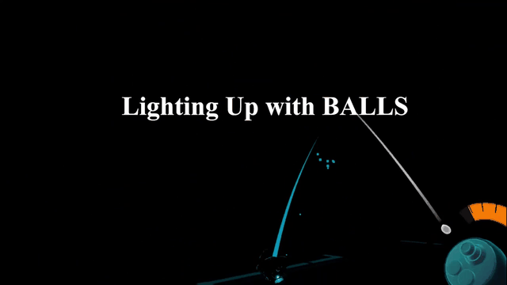

# Sonar Bounce

**Explore by sound. Reveal the dark. Escape the maze.**

Sonar Bounce is a single-player VR maze exploration game built with Unity for CIS5680. Players navigate a procedurally generated, dark maze by throwing sonar balls that briefly reveal their surroundings. Find a route to the exit, evade pursuing enemies, and collect gold to improve your equipment between runs.

This repository contains the Unity project, C# gameplay systems, shaders, scenes, assets, and the recorded gameplay demo.

**Developer:** [LetTucee-T](https://github.com/LetTucee-T) · **Course:** CIS5680 · **Demo headset:** Meta Quest 3

## Gameplay demo

[](DEMO_Video.mp4)

**[Watch the full demo — 1 min 16 sec, MP4](DEMO_Video.mp4)** · [Download the original video](https://github.com/LetTucee-T/VR-Game-Demo-for-CIS5680/raw/refs/heads/main/DEMO_Video.mp4)

The preview above is an excerpt from the included recording. The full video shows sonar exploration, teleportation, enemy encounters, the shop, and the exit.

## How to play

1. **Learn your tools.** Start a new game from the main menu and choose the guided tutorial. It introduces movement, sonar, teleportation, hazards, resource management, and the shop.
2. **Reveal a path.** Grab a sonar ball from your waist holster and throw it. Its pulse exposes nearby surfaces for a short time before the maze fades back into darkness. Use a sticky pulse ball for repeated coverage of an area.
3. **Explore and survive.** Follow the spaces you reveal, listen for the exit ambience, and use the directional locator. Avoid traps and enemy scouts; keep moving or teleport away when pursued. Manage health and energy, and use refill stations along the way.
4. **Collect gold and escape.** Search branching paths for coins, then reach the exit beacon. Gold collected during a random-maze run is deposited into your saved balance when you successfully escape.
5. **Upgrade and return.** Spend your gold in the shop, then enter another maze. Persistent upgrades improve later runs, while consumable upgrades apply to the next run.

The first-time flow is **Main Menu → Tutorial → Shop → Random Maze**, followed by the repeatable **Maze → Shop → Maze** loop.

### Tools and progression

| Tool or system | What it does |
| --- | --- |
| **Sonar ball** | Reveals nearby geometry with a pulse on impact. Useful for quickly checking the route ahead. |
| **Sticky pulse ball** | Attaches to a surface and emits multiple pulses, keeping an area visible for longer. |
| **Teleport ball** | Previews a launch arc and creates a temporary destination that the player can confirm or cancel. |
| **Directional locator** | Scans toward the direction you face to help locate the exit. Shop upgrades add detection for coins, enemies, and refill stations. |
| **Health and energy** | Controller-mounted gauges show current resources. Energy limits sonar use; traps and enemy contact damage health. |
| **Shop upgrades** | Improve health, energy, sonar cost, pulse radius, reveal duration, and more. Examples include **Echo Bounce**, **Blink Echo**, and **Echo Memory**. |
| **Next-run items** | Offer effects such as a starting survey pulse, protection from one lethal hit, or stronger rewards with a resource tradeoff. |

### Controls

The tutorial uses **Meta Touch-style button labels**. Equivalent controls on other devices depend on their OpenXR controller bindings.

| Action | Input |
| --- | --- |
| Move | Left thumbstick |
| Switch joystick / arm-swing movement | **X** — left controller primary button |
| Move in arm-swing mode | Swing the tracked controllers |
| Grab and throw sonar balls | Grip to grab from a waist holster; release to throw |
| Aim / launch a teleport ball | Hold **A** to preview the arc; release **A** to launch |
| Confirm teleport | Press **A** again once the destination is ready |
| Cancel teleport | **B** |
| Trigger the directional locator | Push the right thumbstick forward |
| Pause / resume | **Y** — left controller secondary button |
| Use a health refill station | Point at the station and press Grip |
| Use an energy refill pad | Step onto the pad |

The tutorial unlocks mechanics in stages. For editor debugging, the movement toggle also supports **M**, and pause supports **Esc**.

## Technical highlights

| System | Implementation |
| --- | --- |
| **Procedural level generation** | Seeded maze layouts with a constrained main path, branches, placement rules for rewards and hazards, terrain variants, and deterministic fallback generation. See [MazeGenerator](Assets/Scripts/Generation/MazeGenerator.cs) and [MazeModulePlacer](Assets/Scripts/Generation/MazeModulePlacer.cs). |
| **Sonar visualization** | A runtime pulse manager drives expanding reveal waves, visibility hold times, and fading through a custom shader. See [PulseManager](Assets/Prototypes/SonarBounce/Scripts/PulseManager.cs) and [SonarPulse.shader](Assets/Prototypes/SonarBounce/Shaders/SonarPulse.shader). |
| **Enemy AI** | Patrol, chase, and search states with distance, field-of-view, and line-of-sight sensing. Maze navigation combines graph and grid pathfinding with local navigation and recovery logic. See [EnemyPatrolController](Assets/Scripts/Gameplay/EnemyPatrolController.cs), [EnemyPerceptionSensor](Assets/Scripts/Gameplay/EnemyPerceptionSensor.cs), and [MazeNavigationGraph](Assets/Scripts/Generation/MazeNavigationGraph.cs). |
| **VR interaction and locomotion** | XR Interaction Toolkit grabbing, waist holsters, joystick and arm-swing movement, and a teleport launcher with trajectory preview and confirmation. See [Balls](Assets/Scripts/Balls) and [Locomotion](Assets/Scripts/Locomotion). |
| **Persistent progression** | Gold settlement on escape, randomized shop offers, persistent purchases, and queued next-run effects backed by a JSON profile. See [Progression](Assets/Scripts/Progression). |
| **Onboarding and feedback** | A staged tutorial, controller-mounted gauges, spatial audio cues, chase music, locator effects, and VR menus. See [TutorialLevelController](Assets/Scripts/Gameplay/TutorialLevelController.cs) and [UI](Assets/Scripts/UI). |

## Open the project

### Requirements

| Dependency | Project version |
| --- | --- |
| Unity Editor | **2022.3.34f1** |
| Universal Render Pipeline | **14.0.11** |
| XR Interaction Toolkit | **3.1.2** |
| OpenXR Plugin | **1.14.1** |
| Input System | **1.13.1** |

Use an OpenXR-compatible VR headset with two tracked controllers and a configured runtime for your intended platform. Headset-specific setup may be required. Package versions are declared in [Packages/manifest.json](Packages/manifest.json).

1. Clone the repository:

   ```bash
   git clone https://github.com/LetTucee-T/VR-Game-Demo-for-CIS5680.git
   ```

2. In Unity Hub, add the cloned folder and open it with **Unity 2022.3.34f1**. Allow Unity to import assets and resolve packages.
3. Check **Project Settings → XR Plug-in Management → OpenXR** for your target platform and controller interaction profile. Enable the appropriate OpenXR runtime before testing with a headset.
4. Open [`Assets/Scenes/Gameplay/MainMenu.unity`](Assets/Scenes/Gameplay/MainMenu.unity), enter Play mode with your VR setup, and select **New Game**. The guided tutorial is the recommended starting point.
5. To make a build, use **File → Build Settings**, select the platform supported by your headset setup, install its Unity build module if needed, and keep **MainMenu** as the first enabled scene.

This is a source project; a prebuilt executable or APK is not included. The repository also includes XR Device Simulator samples and enemy test scenes for development, but the main game is designed for VR controllers.

Progress is saved locally as `profile-save.json` under Unity's `Application.persistentDataPath`; player saves are not part of the repository.

## Repository guide

```text
Assets/
  Scenes/Gameplay/          MainMenu, TutorialLevel, random-maze, ShopScene
  Scenes/Tests/             Legacy maze and enemy prototype scenes
  Scripts/
    Balls/                  Grabbing, holsters, sonar, sticky pulse, teleportation
    Gameplay/               Enemy AI, health, energy, hazards, tutorial, locator
    Generation/             Maze generation, placement, navigation, runtime setup
    Locomotion/             Movement modes and arm-swing input
    Progression/            Profiles, gold settlement, shop, upgrades
    UI/                     Menus, gauges, transitions, audio feedback
  Prototypes/SonarBounce/   Pulse manager and core sonar shaders used by the game
  Shaders/                 Additional gameplay and UI shaders
  Prefabs/                 Reusable gameplay objects
  Art/                     Models, materials, and textures
  Resources/               Runtime-loaded assets and audio
  StreamingAssets/         Random-maze configuration profiles
Packages/                  Unity package manifest and dependency lockfile
ProjectSettings/           Unity project, input, rendering, and XR settings
docs/media/                README gameplay preview
DEMO_Video.mp4              Full gameplay recording
```

`Assets/Scenes/Tests/Maze1.unity` and the enemy prototype scenes are development scenes; the normal game loop uses the scenes in `Assets/Scenes/Gameplay`.

Unity-generated caches, build output, IDE files, local notes, and local development tooling are excluded through `.gitignore`. The assets and their Unity `.meta` files are retained so that scene and prefab references survive cloning.

## Credits

The game code and simple custom art assets were independently implemented by **[LetTucee-T](https://github.com/LetTucee-T)** for CIS5680, with extensive **AI-agent assistance** during development. The gameplay demo was recorded using a **Meta Quest 3**.

This portfolio repository preserves the Git history of the [original course repository](https://github.com/TianhongZhou/CIS5680-VR-Game). The project uses Unity's VR Template, XR Interaction Toolkit samples, TextMesh Pro, and bundled third-party art assets alongside the custom game code and art.
